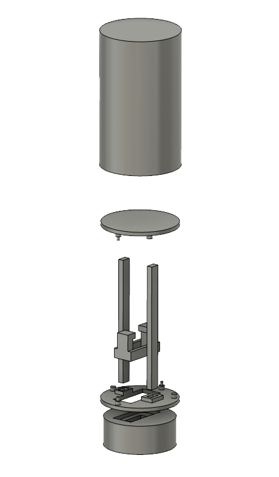
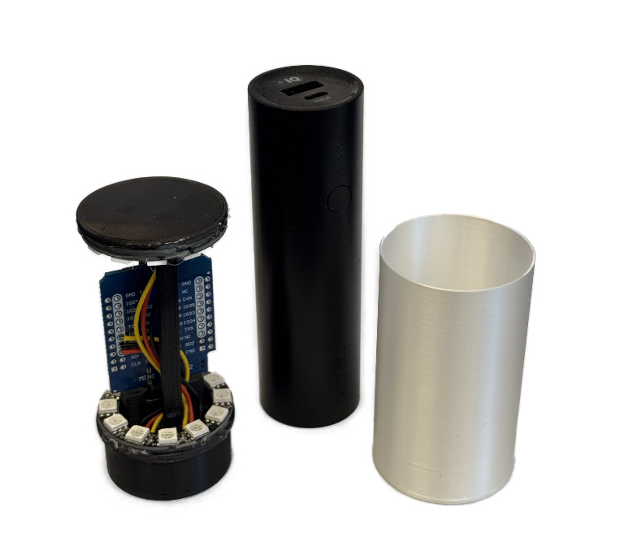
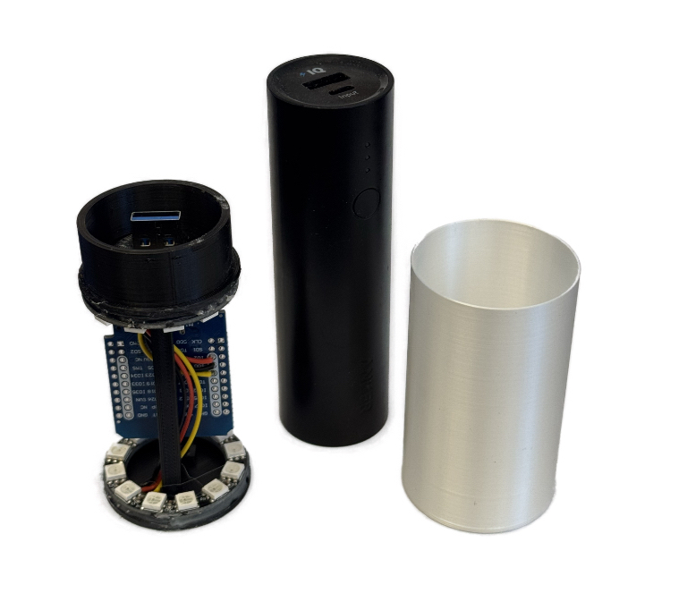

Loctite glue and hot glue gun are you friends :smile:

All files can be printed in PLA. \
To have a nice light diffusion, I printed the `LED cover.stl` file in [_vase mode_](https://all3dp.com/2/cura-vase-mode-all-you-need-to-know/).

