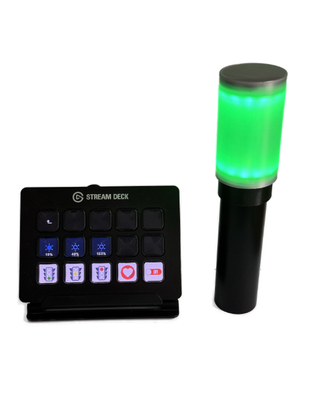
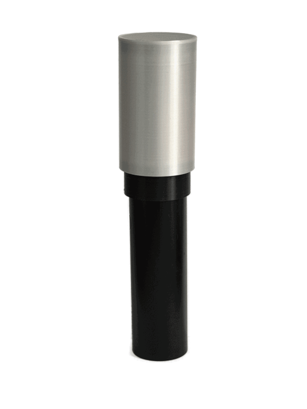
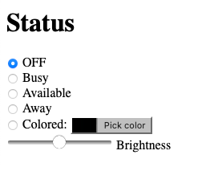
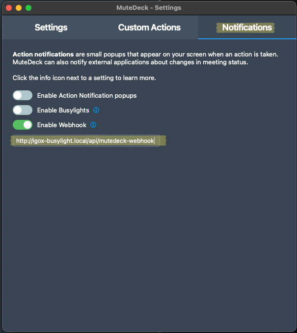
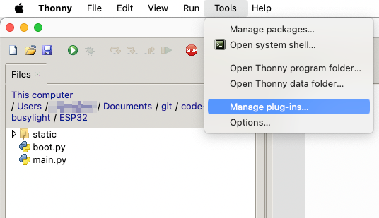
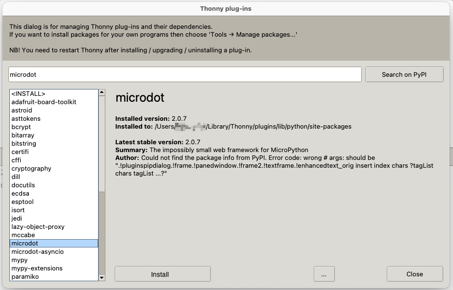
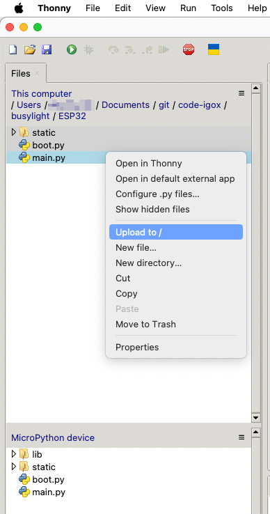

# Table of Content

1. [What's this project?](#whats-this-project)
2. [Web UI](#web-ui)
3. [Stream Deck plug-in](#stream-deck-plug-in)
4. [BusyLight API](#busylight-api)
5. [MuteDeck integration](#mutedeck-integration)
6. [Electronic parts](#electronic-parts)
7. [Firmware installation](#firmware-installation)
8. [3D files - Enclosure](#3d-files---enclosure)
9. [Wiring / Soldering](#wiring--soldering)
10. [Tools & libs](#tools--libs)


# What's this project?

**Let people know if they can bother you with light signals!**

A simple to build, nice looking, portable DIY **Busy Light**.

It comes with a with a rudimentary (and ugly) **Web UI** and a simple (but hopefully convenient) **Rest API**.

| Controlled by Stream Deck with REST API         | Light roll                            |                     
|-------------------------------------------------|---------------------------------------|
|  |   |

# Web UI
A very simplistic (and ugly) UI is available on port `80`. \
Default hostname is `igox-busylight`.

You can try to reach the web UI @ `http://igox-busylight.local`. 

| What an ugly UI ! :smile: |
|---------------------------|
|  |

# Stream Deck plug-in
You can download a Stream Deck plugin to control your BusyLight [here](streamdeck-plugin/README.md).

I will (hopefully) publish it to the [Elgato Market Place](https://marketplace.elgato.com/stream-deck/plugins) soon.

# BusyLight API
## End points
| Path | Method | Parameter | Description |
|--------|------|-----------|-------------|
| /api/color | POST | `color` JSON object | Set the BusyLight color according to the `color` object passed in the request body. Return a `status` object. |
| /api/color |  GET | n/a | Retreive the color currently displyed by the BusyLight. Return a `color` object. |
| /api/brightness | POST | `brightness` JSON object | Set the BusyLight brightness according to the `brightness` object passed in the request body. Return a `status` object. |
| /api/brightness | GET | n/a | Retreive the BusyLight brightness. Return a `brightness` object. |
| /api/status/on | POST / GET | n/a | Light up the BusyLight. White color. Return a `status` object. |
| /api/status/available | POST / GET | n/a | Set the BusyLight in `available` mode. Green color. Return a `status` object. |
| /api/status/away | POST / GET | n/a | Set the BusyLight in `away` mode. Yellow color. Return a `status` object. |
| /api/status/busy | POST / GET | n/a | Set the BusyLight in `busy` mode. Red color. Return a `status` object. |
| /api/status/off | POST / GET | n/a | Shutdown the BusyLight. Return a `status` object. |
| /api/status |  GET | n/a | Retreive the current BusyLight status. Return a `status` object. |
| /api/debug |  GET | n/a | Retreive the full BusyLight status. |

## JSON objects
### `color` object

```
{
  "r": 255,
  "g": 0,
  "b": 127,
  "brightness": 0.5
}
```
`r`: RED color | integer | [0 .. 255]\
`g`: GREEN color | integer | [0 .. 255]\
`b`: BLUE color | integer | [0 .. 255]\
`brightness`: LED brighness (optional)  | float | [0.0 .. 1.0]

### `brightness` object

```
{
  "brightness": 0.5
}
```
`brightness`: LED brighness | float | [0.0 .. 1.0]

### `status` object

```
{
  "status": "<STATUS>"
}
```

\<STATUS\> : `on` | `off` | `available` | `away` | `busy` | `colored`


# MuteDeck integration
The `POST api/mutedeck-webhook` endpoint aims to collect [MuteDeck](https://mutedeck.com/help/docs/notifications.html#enabling-the-webhook-integration) webhook callbacks.

It will automatically switch to the BusyLight in:
- busy mode (Red color) when entering a meeting with Mic `ON` **and** camera `ON`.
- away mode (Yellow color) when entering a meeting with Mic `OFF` **and** camera `ON`.
- away mode (Yellow color) if the mic is muted during a meeting.
- available mode (Green color) when exiting/closing a meeting.

| MuteDeck Configuration                            |
|---------------------------------------------------|
|  |

# Electronic parts
| Parts                   | Links (Amazon - not affiliated)                                                                           |
|-------------------------|-----------------------------------------------------------------------------------------------------------|
| Micro-controler         | [D1 ESP32 Mini NodeMCU](https://www.amazon.fr/dp/B0CDXB48DZ)                                              |
| Led rings (x2)          | [AZDelivery 5 x LED Ring 5V RGB compatible avec WS2812B 12-Bit 38mm](https://www.amazon.fr/dp/B07V1GGKHV) |
| Battery                 | [Anker PowerCore 5000mAh](https://www.amazon.fr/dp/B01CU1EC6Y)                                            |
| USB A to USB C adapter  | [USB A to USB C adapter](https://www.amazon.fr/dp/B0BYK917NM)                                             |

# Firmware installation

**(1)** Flash your ESP32 with [Micropython](https://micropython.org/download/ESP32_GENERIC/).

**(2)** Install [microdot](https://microdot.readthedocs.io/en/latest/index.html) library on the ESP32. This can easily be done using [Thonny](https://thonny.org):

| Tools > Manage plug-ins       | lib selection                       |
|-------------------------------|-------------------------------------|
|  |  |

**(3)** Edit the `WIFI Configuration` section in the [boot.py](ESP32/boot.py) file.

**(4)** Copy the content of [ESP32](ESP32/) folder with the modified `boot.py` file to the root of your ESP32 file system. Again, can easily be done using [Thonny](https://thonny.org):



**Done!**

# 3D files - Enclosure

All the required 3D files (STLs and f3d project) to 3D print the enclosure are available in the [3D-files-to-print](3D-files-to-print/) folder.

# Wiring / Soldering

To be done

# Tools & libs

## Thonny
https://thonny.org

## Micropython
https://micropython.org

## Microdot
https://microdot.readthedocs.io/en/latest/index.html

## JSColor
https://jscolor.com