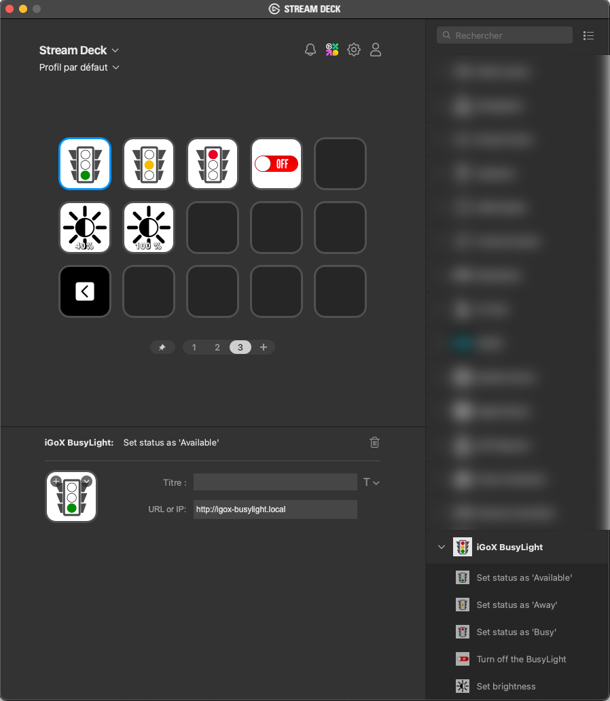

# Release notes

## Version 0.1.0.0 (2024-12-28)

### Download

[org.igox.busylight.v0.1.0.0.streamDeckPlugin](download/org.igox.busylight.v0.1.0.0.streamDeckPlugin)

### Features

- Quick action buttons to set the BusyLight status (Available: green, Away: yellow, Busy: red).
- Quick action button to turn off the BusyLight.
- Button to set the BusyLight brightness.

### Fixes

- None: initial version of the plugin.

### Bugs & known limitations

None known at publication time.

### Screenshot

