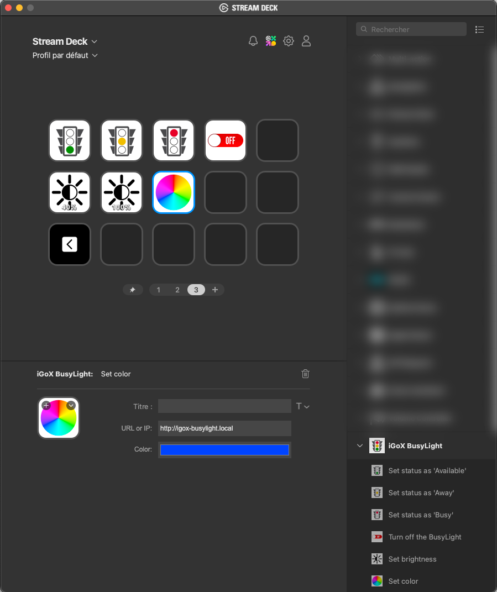

# Release notes

## Version 0.3.0.0 (2024-01-06)

### Download

[org.igox.busylight.v0.3.0.0.streamDeckPlugin](download/org.igox.busylight.v0.3.0.0.streamDeckPlugin)

### Features

- None added

### Enhancements

- Rework icons to comply with plugin guidelines for Elgato Marketplace
- Combine the 3 "status" actions into a single action and having the status be selected with a dropdown

### Fixes

- None.

### Bugs & known limitations

- None known at publication time.

### Screenshot

## Version 0.2.0.0 (2024-12-28)

### Download

[org.igox.busylight.v0.2.0.0.streamDeckPlugin](download/org.igox.busylight.v0.2.0.0.streamDeckPlugin)

### Features

- Add the capability to set the color diplayed by BusyLigh LEDs.

### Fixes

- None.

### Bugs & known limitations

- None known at publication time.

### Screenshot

## Version 0.1.0.0 (2024-12-28)

### Download

[org.igox.busylight.v0.1.0.0.streamDeckPlugin](download/org.igox.busylight.v0.1.0.0.streamDeckPlugin)

### Features

- Quick action buttons to set the BusyLight status (Available: green, Away: yellow, Busy: red).
- Quick action button to turn off the BusyLight.
- Button to set the BusyLight brightness.

### Fixes

- None: initial version of the plugin.

### Bugs & known limitations

- None known at publication time.

### Screenshot

